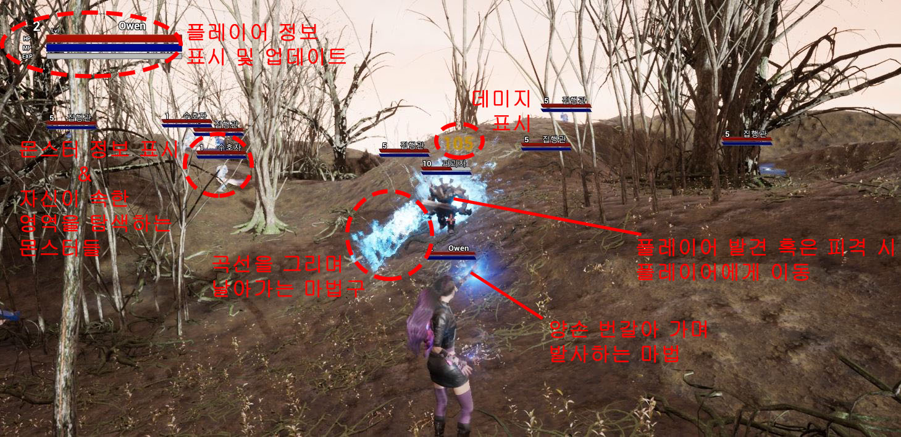
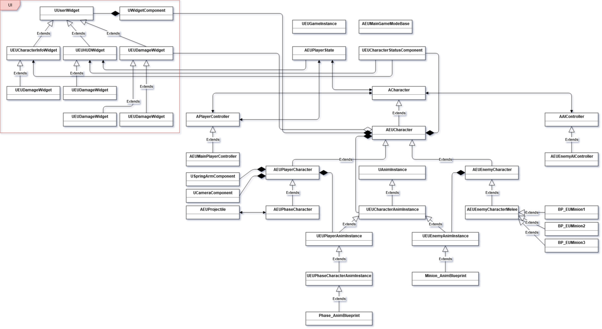

# ExecutionOfUriel (현재 개발중)

## 설명

* 장르: RPG
* 간략 스토리: 대천사 우리엘이 타락한 세상을 심판하는 임무를 수행하기 위해 대리자들을 땅에 내려보내고, 인간들은 이에 맞서 싸운다.
* 개발 진행 상황
	* 완료: 캐릭터 이동과 기본 공격(발사체), 몬스터 AI, 캐릭터 상태, 기본 UI 등
	* 진행중: 원거리 공격 몬스터
	* 계획: 다양한 캐릭터 스킬(범위 스킬, 버프 스킬 등), NPC와 퀘스트 등

## 시스템 구조

* 블루프린트에서 최소한의 것만 조작할 수 있도록, 공통되는 부분은 최대한 부모 클래스에서 수행하도록 구성하였다.
	* 플레이어와 적 캐릭터의 공통된 부분은 AEUCharacter에서 수행하고, 각자 수행되어야 하는 부분은 각각 AEUPlayerCharacter, AEUEnemyCharacter에서 담당한다.
	* AnimInstance 클래스는 캐릭터 상태 업데이트와 몽타주 실행을 담당하고, 이를 상속한 애님 블루프린트는 애니메이션 시퀀스 실행 구성과 애님 몽타주 애셋 할당을 담당한다.

## 개발

* 주 개발 언어: C++, 언리얼 블루프린트
* 개발 환경: 언리얼 엔진(ver. 4.24), VC++(Visual Studio 2019)

## 주의 사항

* https://drive.google.com/drive/folders/1NKz0Ldb4Rhq5a409ueNI0CI18EhWSEue
* 모든 애셋 파일은 위의 구글 드라이브에서 따로 다운받아야 한다.
* Content 폴더 다운로드 후, 프로젝트에 추가
